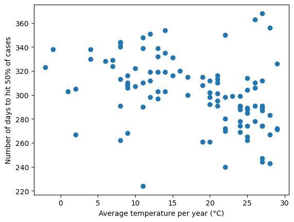
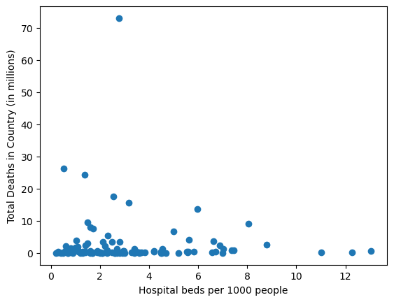
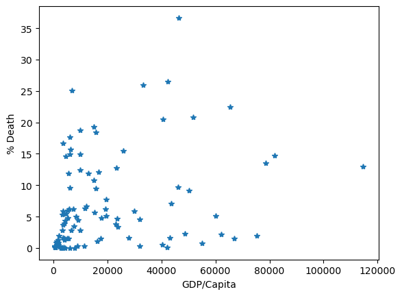

## Chapter 1: The Beginning – Why This Project?

Returning from my exchange at Georgia Tech in November 2022, I was inspired by the brilliant minds I met there. They were either smart or hardworking, or both, and I understood what it truly meant by 'putting in the work'.

In life, you can't just get what you want by waiting for it &ndash; you got to WORK for it.

 You got to put in the extra effort to get that bread. 

I didn't have any personal projects back then, so it was time to get started.

// Add image of Georgia Tech

---

- **The Idea**: To analyze COVID-19 data, visualize and study factors which affect transmission rates.
- **Why It Matters**: COVID-19 affected my dream university life. Period.

  I imagined lots of socializing, hanging out with friends, studying hard and playing hard together. But no. Instead we learnt the existence of Zoom, and the most important thing to bring around (possibly more important than your phone and house keys) was your mask.

---

## Chapter 2: The Research – Diving Into the Unknown

It was about 3 years since the pandemic, and I figured datasets on this hot topic were probably available. And I was right. In fact, plenty were available on just [Kaggle](https://www.kaggle.com/search?q=covid+19+in%3Adatasets) alone.

- **Learning the Basics**: By my 5th semester of undergraduate studies, I had already taken some databases classes, learning what is SQL, what are ACID principles, what are normalization techniques blah blah.
- **The Struggles**: Turns out knowing it as head knowledge vs applying it is completely different. Who would've known! /s

---

## Chapter 3: The Building – The Art of Creation

To apply what I learnt during my classes, I decided to implement a simple SQL server with the datasets I found. This tested my SQL querying and forced me to rely on purely SQL instead of using Python libraries.

Note: I used Python in-built library `sqlite3` to access the SQLite server.

- **Tech Stack**: Python, sqlite3, Pandas and Matplotlib
- **Milestones**: Creating visualizations; Answering self-generated hypothesis using data.
- **Dataset Used**: [COVID19-Dataset-with-100-World-Countries](https://www.kaggle.com/datasets/sambelkacem/covid19-algeria-and-world-dataset)

---

## Chapter 4: The Analysis - The Coding Element

After studying the dataset and understanding what kind of data was available, I came up with 3 hypotheses to test.

#### 1. Does average temperature per year affect how fast COVID spreads (based on number of cases?

Well, I guess not really... Even the polar bears aren't spared...

The only conclusions I got were:

- For the countries that have an average temperature between 8C and 15C, it usually takes about 320 days to reach 50% of its total cases.

- For the countries that have an average temperature between 21C and 27C, it usually takes around 280 days to reach 50%.

#### 2. Is there a correlation between number of medical doctors per 1000 people and the number of deaths?

What am I even... looking at....

> Psst, I see dead people

-- _Kendrick Lamar_

Okay on retrospect, I was pretty disappointed at my analysis. There was really no clear correlation and the comparison between these two data did not show anything.

Moving on...

#### 3. Does a higher GDP/Capita correlate to lower death percentage of the population?

> A ~~sky~~ Chart Full of Stars

-- Coldplay

Hmm... yeah I guess the rich aren't spared from COVID-19 either. Money can't buy happiness nor immunity 🤷‍♂️.

## Chapter 5: The Results – The Final Outcome

You're probably thinking - wow, doesn't seem like he did much this project - nothing was a successful analysis. And you're right, I'm not going to deny that. I wasn't very proud of this project albeit my first, but you know what they say:

The only way is 🆙

- **The Reflection**: This project was only the start of my data analysis journey. Looking back, I should've separated the implementation of SQL server and the data analysis, especially since I wasn't very familiar with either of these.
- **Key Takeaways**: If I could redo this project, I would focus more on data collection, making sure that there are multiple dimensions to the dataset. That way, I will be able to perform feature engineering.

---

## Chapter 6: Looking Back, Then Looking Ahead

We all start somewhere, and the first step is always the hardest. But I'm glad I took it because writing this a few years later, I can safely say I have improved tremendously from the day I did this project. I have plenty to learn still, but I'm proud of the progress I've made.

---

## Appendix

People have asked me why I didn't work for MOH (Ministry of Health) as a data analyst back then. Here were my reasons:

- I didn't know they were hiring analysts for COVID-19
- I thought they already had their own analysts, and wouldn't hire interns.
- I didn't believe in my skills.
