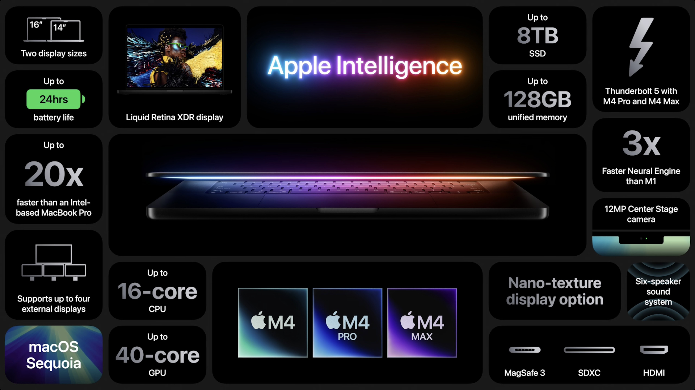
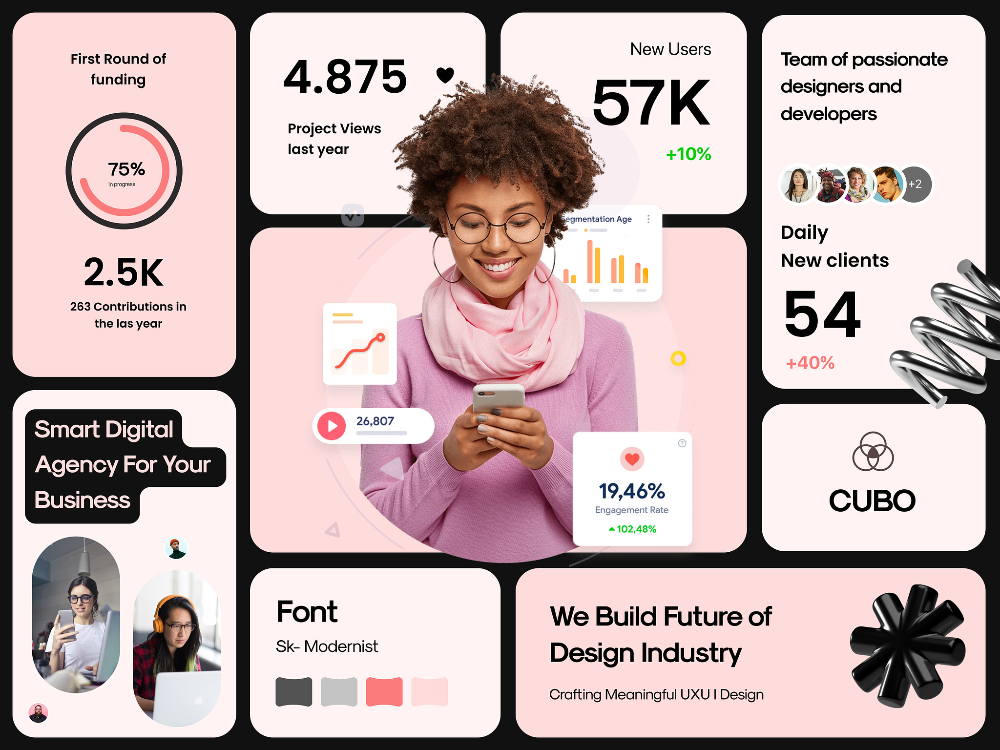
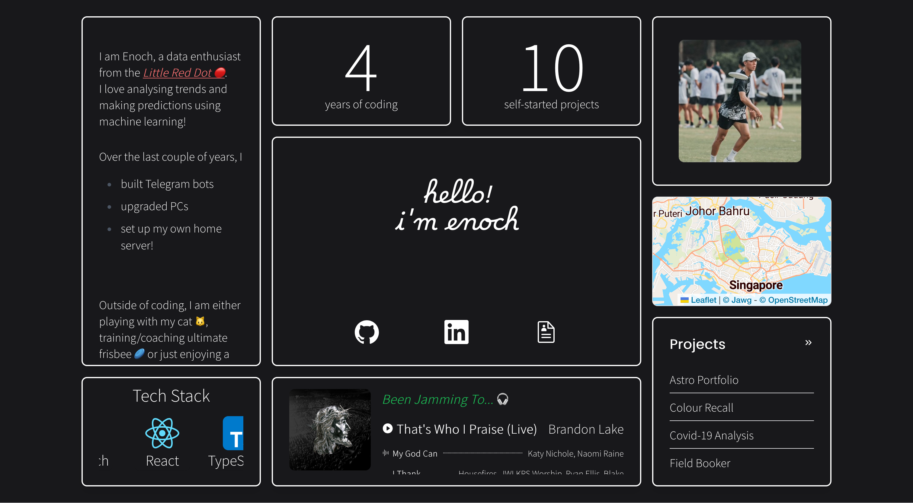
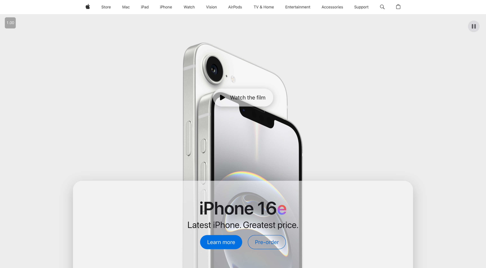
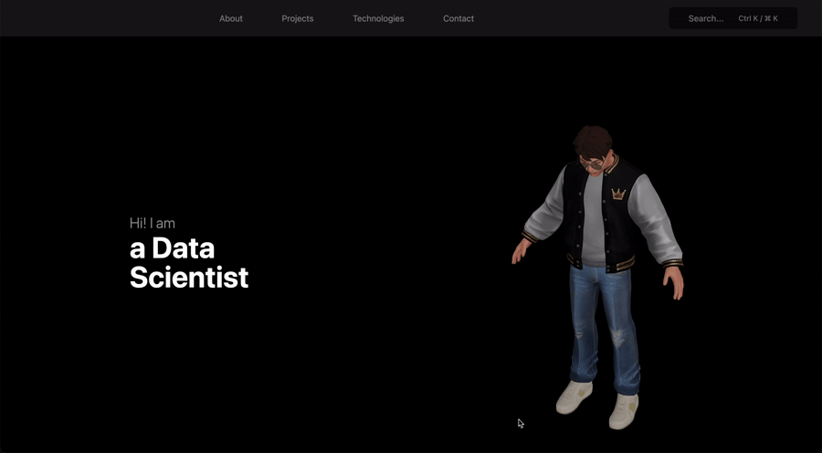

## Chapter 1: The Beginning – Why This Project?

Do I really need to explain myself? Hahah as a developer... it seems like it's mandatory to have a personal website!

Regardless, I found it quite fun, playing around with different frameworks people claim to be _the best_ (spoiler: there's no best). Something about looking at performance comparison charts just gives me that euphoria and excitment to try the best of the best.

- **The Idea**: To create a most performant yet aesthetic personal portfolio website to showcase my projects and skills.
- **Why It Matters**: Faster website = better, right? Aesthetic website = better, right?

---

## Chapter 2: The Research – Finding The Best Tools

I spent hours finding the best tool for the job. Many suggested React because there is just so much support and it's so popular especially with Next.js. I gave that a shot. It was great. Plenty of functions especially with the states and how it makes the website just so responsive.

But do I need such functionalities? I took a step back, and realised all I needed was really a simple static site.

Time to spend even more time research about _the best_ framework for static site! Great! Thankfully people at [Jamstack](https://jamstack.org/generators/) already did that.

With some thorough research, I consolidated a few that were recommended and popular for static sites.

| Framework     | Pros                                                                             | Cons                                                          |
| ------------- | -------------------------------------------------------------------------------- | ------------------------------------------------------------- |
| **Astro**     | - Simple and performant   - Great for static sites   - Easy to learn       | - Limited ecosystem compared to React   - Less mature      |
| **SvelteKit** | - Reactive and fast   - Great developer experience   - Small bundle size   | - Smaller community   - Less mature than React             |
| **Hugo**      | - Extremely fast   - Powerful templating   - Large community               | - Written in Go, which may be unfamiliar   - Less flexible |
| **11ty**      | - Highly customizable   - Fast build times   - Minimalistic                | - Steeper learning curve   - Less out-of-the-box features  |
| **Jekyll**    | - Easy to use   - Large community   - GitHub Pages integration             | - Slower build times   - Ruby dependency                   |
| **Gatsby**    | - Rich plugin ecosystem   - Great for dynamic content   - Strong community | - Can be complex   - Longer build times   - Outdated    |

Did I spend more time searching for _the best_ tool to use than actually creating a website?

100% Yes.

Enough talk about how much time I spent on searching, but perhaps I'll share more later.

- **Learning the Basics**: I relied on Astro's official documentation, various web development tutorials, and articles on modern web design.
- **The Struggles**: Finding a suitable framework for my use case.
- **Moment of Clarity**: When I realised I just had to settle on one and not expect it to be perfect.

---

## Chapter 3: The Building – Be Inspired!

Enough yapping, let's start writing code! I needed inspiration, so I went to Pinterest, Awwwards, Dribble to find the designs that spoke to me.

I really liked Apple's marketing bento designs for their new products. I tried creating something similar, but it just didn't fit the vibe of a portfolio website. It felt more like a marketing website.

I also liked Apple's main page, something about it makes the design just so clean.

Well... let's just say I tried. It was going well until I forgot to commit a bunch of changes to GitHub. Rookie mistake 😐.

It was also aesthetic but I wasn't very motivated to continue perfecting it. I just wanted a working portfolio website to show my projects and hopefully be more hireable as a data scientist, not a web developer.

Not my proudest moment, but I ended up going back to Astro because I get to use the Markdown features to write about my projects.

Next.js → Astro → 11ty → SvelteKit → Next.js → Astro

- **Tech Stack Choices**: Astro for its simplicity and performance benefits. JavaScript and CSS were used for interactivity and styling.
- **Personal Struggles**: Decision paralysis between frameworks. The pursuit of perfection stalled my progress &ndash; I aimed for a stunning portfolio, but over-focusing on aesthetics kept me from finishing anything.

---

## Chapter 4: The Breakthrough – Done Is Better Than Perfect

By writing down everything that I wanted to implement on my website, I feel alot more relieved. I categorized the features I want for my MVP, and those that are for aesthetics and are optional.

Once all my MVP features are implemented, I will include it in my LinkedIn and resume, and when I feel like it, I'll work on the remaining optional features.

---

## Chapter 5: The Result – The Final Outcome

Well, when you see this, the website is ready to be SERVED (excluding the optional features).

I want to try other frameworks to build websites or business landing sites in the future.

Heard good things about Hugo for its fast build speeds so I really want to give that a try.

Drop me an email to build websites for you!
