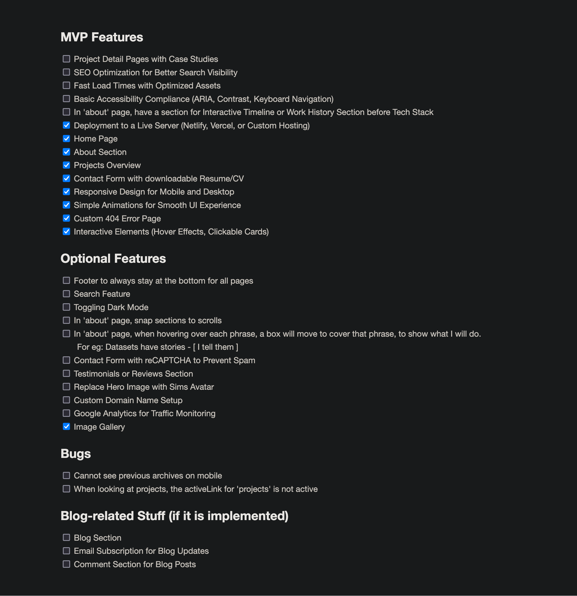

## Chapter 1: Done Is Better Than Perfect

By writing down everything that I wanted to implement on my website, I feel alot more relieved. I categorized the features I want for my MVP, and those that are for aesthetics and are optional.

Once all my MVP features are implemented, I will include it in my LinkedIn and resume, and when I feel like it, I'll work on the remaining optional features.

---

## Chapter 2: The Result

Well, when you see this, the website is ready to be SERVED (excluding the optional features).

I want to try other frameworks to build websites or business landing sites in the future.

Heard good things about Hugo for its fast build speeds so I really want to give that a try.

Drop me an email to build websites for you!
